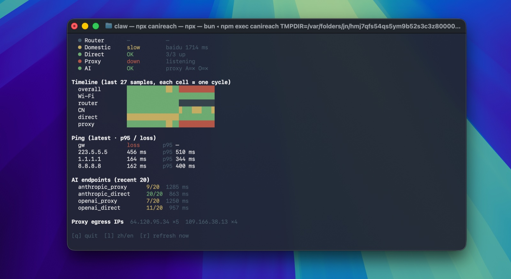

# canireach

> Can I reach the AI? Local network + AI-service-availability monitor — answers "is the network up?" and "is the AI up?" at a glance. TUI by default, web dashboard under `--web`.



## Quick start

Requires [Bun](https://bun.sh/) (`curl -fsSL https://bun.sh/install | bash`). Then:

```sh
npx canireach                # terminal UI (default)
npx canireach --web          # web dashboard at http://localhost:8787 (opens browser)
npx canireach --once         # one probe → JSON
```

`bunx canireach` works the same. If you've cloned the repo, `bun src/cli.ts` is the local equivalent.

## What it checks

Each cycle (~60 s by default) it samples:

- **Link layer** — Wi-Fi RSSI / channel / tx-rate if you're on Wi-Fi, or just "Ethernet" if on a wired adapter.
- **LAN** — ping to your gateway.
- **Domestic Internet** — ping `223.5.5.5`, HTTPS to `baidu`, `taobao`. (Useful even outside CN; failing here = ISP-level outage.)
- **Overseas direct** — HTTPS to `google`, `cloudflare`, `github` without proxy.
- **Proxy** — if a proxy is configured (env, macOS system proxy, or `CANIREACH_PROXY`), checks the listener and HTTPS through it. If no proxy is configured, this layer is reported as `skipped`, not as a failure.
- **AI services** — `api.anthropic.com` and `api.openai.com`, via direct and (if available) via proxy. Any HTTP response = reachable (these are auth-protected endpoints).
- DNS resolution against system + `223.5.5.5` / `119.29.29.29` / `8.8.8.8` / `1.1.1.1`.
- Captive-portal detection (`captive.apple.com`).

The dashboard answers two questions with two headline indicators:

1. **Is the network up?** (wifi → lan → broadband → overseas direct → proxy)
2. **Is the AI up?** (Anthropic / OpenAI, via proxy and/or direct)

## TUI keys

| key | action |
|---|---|
| `q` | quit |
| `l` | toggle language (zh / en) |
| `r` | refresh now |

The TUI auto-detects whether a daemon (started via `--web`) is already running. If yes, it follows that daemon's `samples.jsonl` and doesn't double-probe. If no, it probes in-process.

## Environment variables

| var | default | what it does |
|---|---|---|
| `CANIREACH_PROXY` | (auto) | Force a proxy URL (e.g. `http://127.0.0.1:7890`). Set to `none` or `off` to explicitly disable proxy probes. Otherwise: env (`https_proxy`/`http_proxy`/`all_proxy`) → macOS `scutil --proxy` → no proxy. |
| `CANIREACH_LANG` | (auto) | `zh` / `en`. Auto-detected from `$LANG`. |
| `CANIREACH_INTERVAL_MS` | `60000` | Probe interval (TUI and daemon). |
| `CANIREACH_PORT` | `8787` | Dashboard port (web mode only). |
| `CANIREACH_DOWNLOAD_EVERY` | `10` | Throughput sample cadence (every Nth cycle). |
| `CANIREACH_NO_OPEN` | `0` | Set to `1` to skip opening the browser in `--web` mode. |

`--no-open` on the command line does the same as `CANIREACH_NO_OPEN=1`.

## Who it's for

- People behind regional restrictions, monitoring whether a proxy chain to AI APIs is healthy.
- People on unstable Wi-Fi who want layered diagnosis (is it Wi-Fi? router? ISP? proxy node?).
- People connecting via Ethernet / USB-C LAN / Thunderbolt — the Wi-Fi layer is marked "skipped" instead of pretending to be broken.
- People with **no proxy at all** (overseas direct, or just don't use one) — the proxy layer is marked "skipped" and AI is judged on direct reachability alone.

## Layout (source)

- `src/cli.ts` — entry point. Dispatches between TUI, web, and one-shot.
- `src/tui.ts` — terminal UI. Raw ANSI + Unicode block cells; no extra deps.
- `src/probe.ts` — one-shot sample collector.
- `src/probes.ts` — individual probe implementations + proxy/link detection.
- `src/verdict.ts` — turns a sample into a layered verdict + AI indicator.
- `src/daemon.ts` — long-running collector. Writes `data/samples.jsonl` + `data/state.json`.
- `src/server.ts` — Bun HTTP server with JSON APIs over the samples.
- `public/index.html` — single-page dashboard (Chart.js, vendored).
- `data/`, `logs/` — runtime output (gitignored).

## License

MIT.
